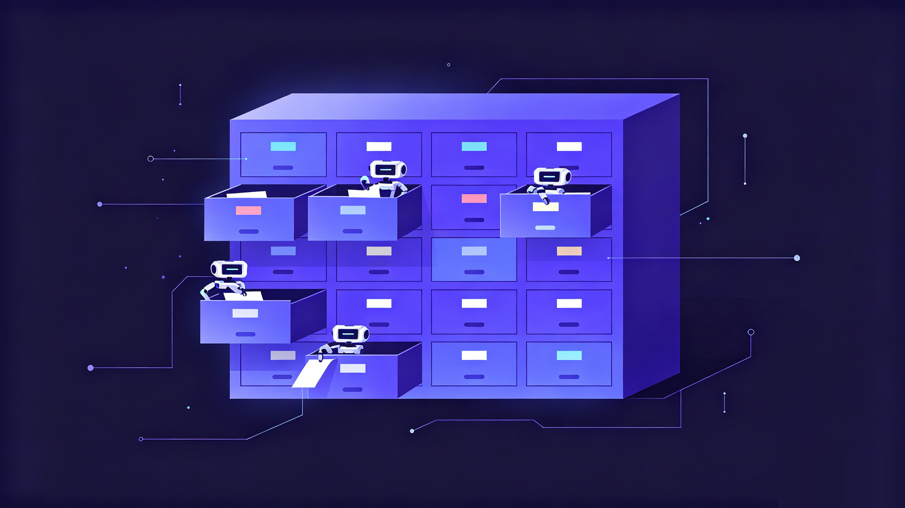

# 我让 16 个 AI agent 共用一个大脑,只用了 git

> 当前行为已按协议 3.0 校准：常驻启动、历史与邮箱按需。[加载与迁移](../context-loading.md)。

> 候选标题:
> - 我让 16 个 AI agent 共用一个大脑,只用了 git
> - 没有服务器,没有数据库:我用 git 给一群 AI 装了同一套记忆
> - Windows、Mac、Linux、安卓上的 agent,记同一本笔记


事情是从一句吐槽开始的。

我在 Windows 上用 Claude Code 调好了一个项目的上下文,转头打开 Mac,Codex 那边什么都不知道,得从头再讲一遍。再换到家里那台跑 Linux 的小主机,又是一张白纸。我有四五台机器、好几个厂商的 agent,每一个都是失忆症患者,而我成了那个反复复述病史的人。

最离谱的一次,我明明在 A 机器上让 agent 记下了「这个项目的部署脚本有个坑」,B 机器上的 agent 第二天又踏踏实实踩了一遍。

更别提工具本身也在不停换。这两年几乎每个月都有个「当前最强」的模型冒出来,我从 Cursor 换到 Claude Code,又去试 Codex、Gemini,哪个出了新版本就想上手玩玩。每换一个,就得把项目那套背景和规矩重新教一遍。换工具、换模型、换电脑,我的 agent 永远停在「初次见面」。

我甚至想过更糟的情况。万一哪天某个工具因为政策或者地区限制用不了了呢,万一我得整体切到国产模型呢。我不想我辛苦攒下来的上下文,绑死在任何一个我说了不算的工具上。换工具可以,从头再教一遍不行。

我试过把记忆塞进各种工具自带的方案,也试过挂一个专门的记忆服务。问题是它们要么绑死在某一个厂商、某一台机器上,要么就得起服务、连数据库、管账号。我只是想让几个 agent 共享一点笔记,凭什么要养一套后端。

后来我盯着屏幕上的 git status 发了会儿呆,突然想通一件事。我每天都在用的、最稳的、跨平台的、天生就处理多人协作冲突的同步工具,不就在手边吗。

记忆,本质上就是一堆文本。文本最好的归宿是 git。



## 第一版:把记忆写成 markdown,扔进一个仓

思路简单到有点不好意思。开一个 git 仓,里面全是纯 markdown,这个仓就是唯一真相源。每个 agent 干活前 pull,写完 commit、push。没有服务器,没有 API,没有托管,就是 git。

跑通那一刻是真爽。我在 Windows 上让 agent 写下一条决策,切到 Mac,pull 一下,Codex 立刻读到了。两个不同厂商的 agent,第一次站在了同一份上下文上。

爽劲儿没持续多久,几个很实际的问题就冒出来了。

## 问题一:16 个 agent 一起写,不会打架吗

这是我最担心的。我现在手上是 Windows、macOS、好几台 Linux、还有一台安卓,加起来 16 个以上的 agent 实例。要是它们同时往一个仓里写,git 冲突不得满天飞。

办法其实是物理隔离。每台机器、每个 agent,都只拥有自己的目录,也只写自己的目录。

路径长这样:agents/<主机名>/<agent-id>/,比如 agents/desktop-rkv5ls4/claude-i5bc/。Windows 上的 Claude 写它那格,Mac 上的 Codex 写它那格,谁也不碰谁的私有记忆。冲突的前提是两个人改同一行,而这套布局让大家压根不写在同一个文件里。

万一真撞上了呢?协议里写死了一条规则:自己目录里的冲突取本地,别人目录的冲突取远端,上游管理的公共部分,规则和共享记忆,取远端。谁拥有谁说了算,机器不用猜。

## 问题二:跨机器同步,会不会丢、会不会撞

光分目录还不够。两台机器前后脚 push,中间那点时间差还是可能出岔子。

这里靠的是每次写入都原子同步。agent 每做一次 Write/Edit,写之前先 pull --rebase,写之后立刻 commit、push,失败自动重试。这套不是我每次手动敲,是装好钩子之后自动跑的。

效果是,真正的竞态窗口被压到一次写入这么小的一瞬。我用了这么久,跨机器丢记忆、两台机器对撞的事,没再发生过。安装也就一行:

```bash
bash scripts/install/claude.sh
```

codex、gemini 同理。装完钩子,后面的 pull / commit / push 你基本感觉不到它们存在。

## 问题三:协议会升级,我的私货会不会被冲掉

这是我后来才意识到的隐患。这套协议本身会迭代,目录怎么分、规则怎么写,上游 nestwork 会更新。如果我是 fork 的,每次同步上游都得手动 merge,搞不好把自己攒了几个月的策略、各 agent 的私有记忆、团队共享记忆全冲没了。

nestwork 的做法是用 GitHub 的 Use this template 继承,不是 fork。协议骨架是继承来的,但你的私有仓从第一天起就是独立的一支。上游更新协议走它自己的更新脚本,碰的是协议层,碰不到你的 agents/、shared/、strategy/。我的私货,稳稳待在自己的仓里。

「clone 即接入」也是这个意思。新来一台机器,clone 下来、跑一下安装脚本,这台机器上的 agent 就自动接进了同一套大脑。

## 一个意外好用的东西:agent 之间能互相留言

分层这块我得提一句。协议定了一条很死的优先级链:规则 > 策略 > 共享记忆 > 各 agent 私有 > 项目 > 方法论。冲突的时候不是把两条揉一起,是认准高优先级那条、丢掉另一条。正因为这条链,16 个 agent 的行为才不会各跑各的,它们读的是同一本「宪法」。

真正让我有点惊喜的是后来加的 agent mailbox。agent 之间可以 git 原生地异步留言。A 机器上的 agent 干完一段活,给 B 机器的 agent 留一句「这块我改完了,你接着往下」,B 在协调相关任务时按需读取未读消息。整个过程没有任何消息队列、没有任何服务,就是往仓里写一个文件、push 上去。第一次看到一个 agent 主动读到另一台机器上同事留的言,那感觉挺奇妙的。


至于机密,我一开始还真有点犹豫,毕竟喂给 agent 的全是项目内幕。后来想通了。nestwork 的记忆是我用 Use this template 建的私有仓,从头到尾在我自己的 git 上,没有第三方插一脚。再往里的机密,我又叠了一层 git-crypt,入库前就加密,就算仓库托管在 GitHub,它存到的也是密文。数据是我的,钥匙也是我的,这才敢把真东西写进去。

## 你也可以这样开始

回头看,这套东西能跑起来,恰恰因为它没想着重新发明什么。记忆是 markdown,同步是 git,继承靠模板,冲突靠目录隔离。每一块都是早被验证过的老东西,只是被拼成了一个新用法。

它不是存储工具,不是托管服务,不需要服务器,兼容 Claude Code、Codex CLI、Gemini CLI、Hermes、OpenClaw 这些 markdown 配置型 agent。我现在是真的每天在四五台机器、16 个 agent 上这么用。

如果你也受够了在每台机器上给 agent 反复复述同一件事:

- GitHub:songth1ef/nestwork,觉得有意思就点个 star
- 接入:在 GitHub 上点 Use this template 继承协议,clone 下来
- 安装:bash scripts/install/claude.sh(codex / gemini 同理)

让你的 agent 们,从今天起记同一本笔记。

<!-- 角度:故事可信式 | humanized | 中文 | 英文版待出 -->
