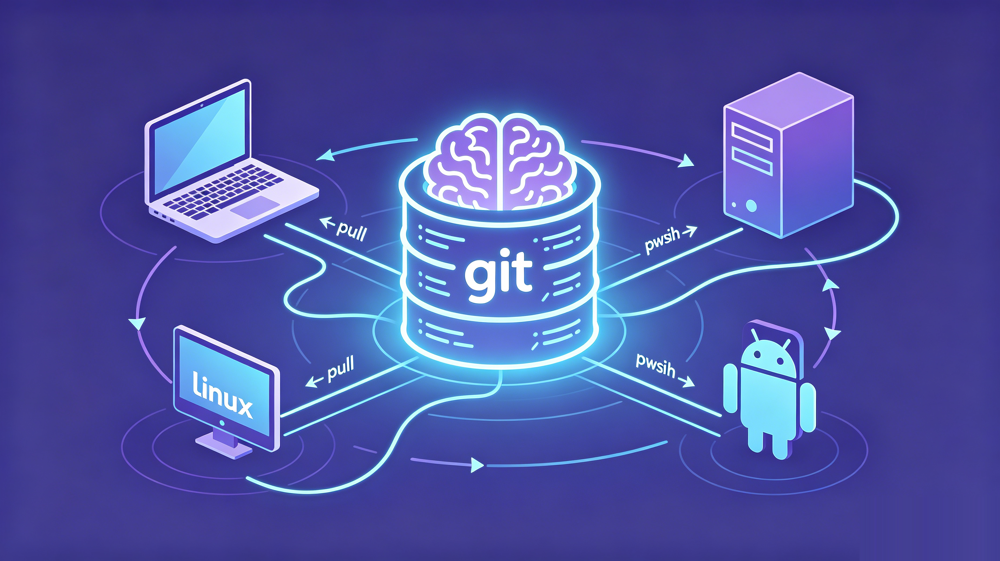
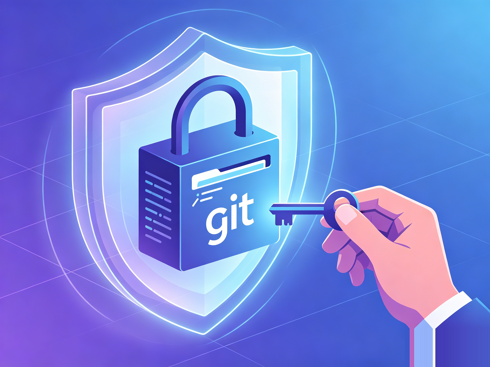

# 你的 AI agent 一换设备就失忆

> 当前行为已按协议 3.0 校准：常驻启动、历史与邮箱按需。[加载与迁移](../context-loading.md)。

> 候选标题:
> - 你的 AI agent 一换设备就失忆
> - 一个 git 仓,让我 16 个 agent 记同一本笔记
> - 别再给 agent 重复交代上下文了


昨晚在笔记本上,我用 Claude Code 把一个项目交代得明明白白。技术栈、命名习惯、那几个不能踩的坑、上次为什么放弃了某个方案。聊得正顺。

今早坐到台式机前,打开 Codex,想接着干。它什么都不记得。

代码规范?重讲一遍。项目背景?重讲一遍。「上次说过那个目录别动」?它根本不知道有过上次。我对着屏幕,把昨晚那套话又敲了第二遍。

这个画面你大概也熟。换台机器、换个工具、换个项目,甚至只是隔了几天,AI 助手就像被格式化过,干干净净、客客气气地失忆。

而且这两年,你换的还不只是机器。几乎每个月都有人发布「当前最强」的模型。Cursor 用着用着想试 Claude Code,过阵子 Codex 出了新版本又想切,Gemini 更新了再回头看看。每切一次工具,就得把项目背景、代码规范、那些踩过的坑,重新调教一遍。再赶上换台新电脑,又是从零开始。工具在变、模型在变、机器在变,只有那套要反复交代的上下文,一直在原地打转。

换工具有时候还轮不到你选。政策、地区限制、账号、价格,哪天你重度依赖的那个工具突然用不了了,记忆要是绑在它身上,就跟着一起停摆。包括哪天你想整体切到国产模型,你也希望换掉的只是工具,不是又从头教一遍。

## 失忆是一笔一直在扣的税

我们总把它当成「再说一遍呗」的小事。它其实是税。

每天重新交代上下文,是时间税。Claude Code 在这台机器学到的教训,Codex 在那台机器一无所知,是知识的浪费。更阴的是,你根本记不全自己上次交代过什么,于是 agent 拿着残缺的上下文给你干活,还错得理直气壮。

市面上不是没有「给 AI 加记忆」的东西。多数是一个思路:搞个记忆数据库,或者一个托管的记忆服务,把对话存进去,用的时候检索出来。它能解决「单个 agent 在单台机器上记不住」。

可我的麻烦不在这。我手里不是一个 agent,是一堆。笔记本上的 Claude Code、台式机上的 Codex、服务器上挂着的 Gemini,各记各的,或者干脆共享不了。问题从来不是「记忆存哪」,是这一堆 agent、跨着好几台机器,怎么共用同一份记忆还不打架。

## 换个思路:记忆就是一个 git 仓

nestwork 的做法,第一次看到我有点「啊,还能这样」。

它不是工具,不是服务,不需要服务器。它是一套 git 原生的多 agent 记忆与协作协议。

核心简单到反直觉:所有记忆就是一个 git 仓里的纯 markdown。这个仓就是唯一真相源。agent 干活前 pull,写完 commit、push。换台机器?clone 下来就接上。换个工具?只要它是 markdown 配置型的(Claude Code、Codex CLI、Gemini CLI、Hermes、OpenClaw 都行),读的是同一个仓。

笔记本上学到的东西 push 上去,台式机上 pull 下来,Codex 立刻「记得」。不是因为某个云在中间转发,是因为它们本来就在读写同一个 git 仓。

git 干的就是这事:多人、多机、版本化地共享一堆文本文件。nestwork 只是发现,agent 的记忆,本质上就是一堆该被共享的文本文件。那为什么不直接拿 git 当传输层。



## 它真正解决的是「一堆 agent 怎么协同」

如果只是「拿 git 存 markdown」,那还只是个聪明的小技巧。让我留下来的,是它把多 agent 协作里的脏活想清楚了。

跨机是真跨机。用的是 git remote,你的笔记本、台式机、几台 Linux、甚至安卓上的 agent,只要能 push,就在同一个大脑里,不用挤在同一台机器同一个目录下排队。

多个 agent 同时写,不打架。每台机器、每个 agent 都有自己的目录,只写自己的。冲突时规则很硬:自己的目录取本地,别人的目录取远端。各扫门前雪,从机制上就不会互相覆盖。

写入是原子的。每次写之前先 pull --rebase,写完 commit、push,失败自动重试。竞态窗口被压到一次写入那一瞬,而不是整个会话敞着。

冲突有人裁,而且不和稀泥。记忆是分层的,优先级写死:行为规则 > 策略 > 共享记忆 > 各 agent 私有 > 项目 > 方法论。两条指令打架,认高优先级那条,不许把两个揉一起。揉出来的「折中指令」往往最坑,nestwork 直接禁掉。

记忆会被蒸馏。各 agent 私有的零散观察,会合并进共享记忆。这一步不粗暴:先派个子 agent 审一遍,查敏感信息、查事实错、查矛盾,再交人确认,而且只合并、只新增,不删你的原始记录。

agent 之间还能留言。内置一个 git 原生的 mailbox,一个 agent 给另一个异步留言,对方在协调相关任务时按需读取未读消息。跨机器的 agent 第一次有了「带消息」这回事。

## 你的记忆,在你自己的仓里

还有一点我后来越想越重要:这套记忆从头到尾都在你自己手里。

托管的记忆服务,你的上下文是存在别人服务器上的。nestwork 不一样。你用 Use this template 建的是你自己的 private 仓,记忆就躺在里面,GitHub 也好、自建 Git 也好,仓是你的,数据是你的。嫌这还不够,可以再叠一层 git-crypt,把记忆在入库前就加密,连仓库托管方拿到的都只是一堆密文,读不到明文。

对要把项目背景、内部踩坑、商业判断喂给 agent 的人来说,这不是锦上添花,是敢不敢用的前提。



## 这不是 PPT,作者自己天天在用

作者本人就在 Windows、macOS、好几台 Linux、安卓上,跑着 16 个以上的 agent 实例,共用同一套 nestwork 记忆。这套协议不是设计出来给人看的,是他自己每天离不开的东西。

还有个细节我挺喜欢:接入是 GitHub 的 Use this template,不是 fork。fork 之后上游一更新,容易把你的私有数据搅进来;模板继承让你拿到协议骨架,但记忆始终是你自己仓里的私货,上游更新覆盖不到。

## 三步给 agent 接上记忆

去 GitHub 搜 songth1ef/nestwork,顺手 star 一下,方便回头找。

用 Use this template 建个你自己的私有仓,clone 下来,装上对应工具的钩子:

```bash
bash scripts/install/claude.sh
# Codex、Gemini 同理
# bash scripts/install/codex.sh
# bash scripts/install/gemini.sh
```

装完,pull / commit / push 这些同步是自动跑的,你该怎么用 agent 还怎么用。只不过这次,它换台机器、换个工具,记得住了。

先在两台设备、两个工具上试一周。哪天你换了机器,打开 agent,它张口就接上昨天的活,你就懂了。

<!-- 角度:痛点式 | humanized | 中文 | 英文版待出 -->
