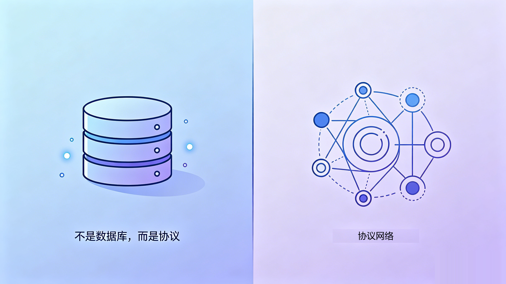

# AI Agent Memory Isn't a Database Problem, It's a Protocol Problem

> Candidate titles:
> - AI Agent Memory Isn't a Database Problem, It's a Protocol Problem
> - When Multiple Agents Work Together, the Hard Part Was Never "Where to Store Memory"
> - 16 Agents Sharing One Memory Need a Protocol, Not Another Database



Almost every memory solution built for AI agents answers the same question: where does memory live, and how do you fetch it back. Vector stores, knowledge graphs, hosted memory services. The routes differ, but the core is identical. They all treat memory as a storage-plus-retrieval problem.

For a single agent, that assumption holds up fine. One agent, one machine, one context. Store it accurately, pull it back reliably, and the job is done.

But the moment you cross a certain line, running several agents at once, across multiple machines, across multiple vendors, the nature of the problem changes.

## What Actually Blocks You Isn't "Where to Store It"

Picture a scenario that isn't even extreme. You run Claude Code on Windows, Codex CLI on macOS, Gemini on two Linux boxes, and one more on your phone. In theory they're supposed to "share memory."

Here's what you actually run into. Agent A just wrote down a conclusion, but Agent B is still working off a version from three hours ago, and both think they're right. Who's authoritative? Two machines edit the same memory file at almost the same instant. How do you sync, and how do you not overwrite each other? A throwaway debugging note: should every agent see it and get dragged off course by it, or not? What should be shared, and what should stay private?

Notice that not one of these is a "where to store it, how to retrieve it" question. They're about authority, synchronization, concurrency, and boundaries. These are protocol-level problems. No vector search, however fast, and no semantic recall, however clever, solves "two agents write at the same time, whose write wins." A database manages data. It can't manage collaboration.

nestwork aims straight at that gap. It isn't another memory database. It's a collaboration and governance protocol built for multiple agents.


## What It Looks Like: Git-Native, Plain Markdown, No Server

The form nestwork takes is almost counterintuitively simple. Memory is just plain markdown in a git repo, and that repo is the single source of truth. No server, no hosted backend, no SaaS to sign up for. Agents sync through pull / commit / push, and the git remote is the transport layer. That means cross-machine sync is genuinely cross-machine, not sync inside some cloud tenant.

Onboarding is git's native tongue too. Use GitHub's Use this template to inherit the entire protocol, and you're connected the moment you clone. There's an underrated benefit here: what you inherit is your own private repo. Your memory grows in your hands from day one, instead of sitting in some vendor's backend. For sensitive content you can layer git-crypt on top, so it's encrypted on the way in and the repo host only ever sees ciphertext. Inheriting rather than forking also means that when upstream updates the protocol, it never touches your private data.

A hosted memory service can't give you this. Once you hand your context over, it lives in someone else's database. One of the upsides of being git-native is that ownership of the data never leaves you, start to finish.

What it's compatible with is a whole class of agents. Claude Code, Codex CLI, Gemini CLI, Hermes, OpenClaw, all of these markdown-configured agents can plug into the same memory.

That matters a lot right now. There's a new "best model ever" practically every month. You're on Cursor today, you want to try Claude Code tomorrow, and the day after that Codex or Gemini ships an update. Tying your memory to one tool is betting that the tool never gets left behind.

And it's not just about getting left behind. Policy, regional restrictions, accounts, pricing, any one of these can make a tool you can't live without today suddenly unusable one day. When that happens, the deeper your memory is tied in, the more it hurts to move. Plain text bound to git is tool-agnostic. Whoever comes, whoever goes, the memory is still there. The day you need to switch wholesale from an overseas tool to a domestic model, your context stays exactly where it is. The only thing that changes is the agent reading it.

## Why Call It a Protocol and Not a Tool

Calling it a protocol isn't rhetoric. What holds up that label is a set of concrete mechanisms, each one answering a question the database doesn't.

Layered priority plus conflict adjudication. Memory is layered: behavior rules > strategy > shared memory > each agent's private memory > projects > methodology. When two instructions conflict, the rule is hard: take the higher-priority one, no splitting the difference and merging the two into mush. This is governance. It's the explicit answer to "who's authoritative."

Write permissions isolated per machine and per agent. Each agent writes only its own directory. The moment a pull hits a conflict, the resolution is deterministic: take local for your own directory, take remote for someone else's, take remote for upstream-managed layers. Concurrent writers don't fight at the root.

Every write is an atomic sync. Pull --rebase before writing, commit and push with retry after. The race window is squeezed down to the instant of a single write, instead of staying open across an entire session.

Distillation. How do several agents' separate private memories settle into facts everyone shares? Through a distillation flow: first dispatch a sub-agent to review, checking for sensitive information, contradictions, and stale entries, then hand it to a human to confirm, and finally merge it non-destructively into shared memory, only combining and only adding, never deleting anyone else's observations.

Agent mailbox. Agents can do more than read the same shared memory. They can leave messages for each other, a git-native form of asynchronous communication. Collaboration goes from "everyone staring at the same whiteboard" up to "able to talk point to point."

Protocol version governance. Protocol evolution is marked with MAJOR.MINOR, and limits can even be overridden per instance. It behaves like a spec that iterates, not a static software package.


## People Are Actually Running It

The most convincing thing isn't the list of mechanisms. It's that the author is dogfooding it himself. Windows, macOS, several Linux boxes, Android, more than 16 agent instances, all sharing the same memory. It isn't a demo repo. It's a real workload in daily use.

## A Different Frame

When you have just one agent, what you need might genuinely be a good memory store. But the moment you start having multiple agents, across multiple machines, across multiple vendors, work together, sooner or later you'll find the bottleneck isn't "where to store it, how to retrieve it." It's "who's authoritative, how to sync, how not to overwrite each other."

At that moment, what you need isn't another database. It's a protocol.

## Getting Started

```bash
bash scripts/install/claude.sh   # codex / gemini work the same way
```

GitHub: songth1ef/nestwork. If this framework speaks to you, give it a star. If you want to run it right away, use Use this template to inherit the protocol, and you're connected the moment you clone.

<!-- category-creation angle | humanized | EN -->
