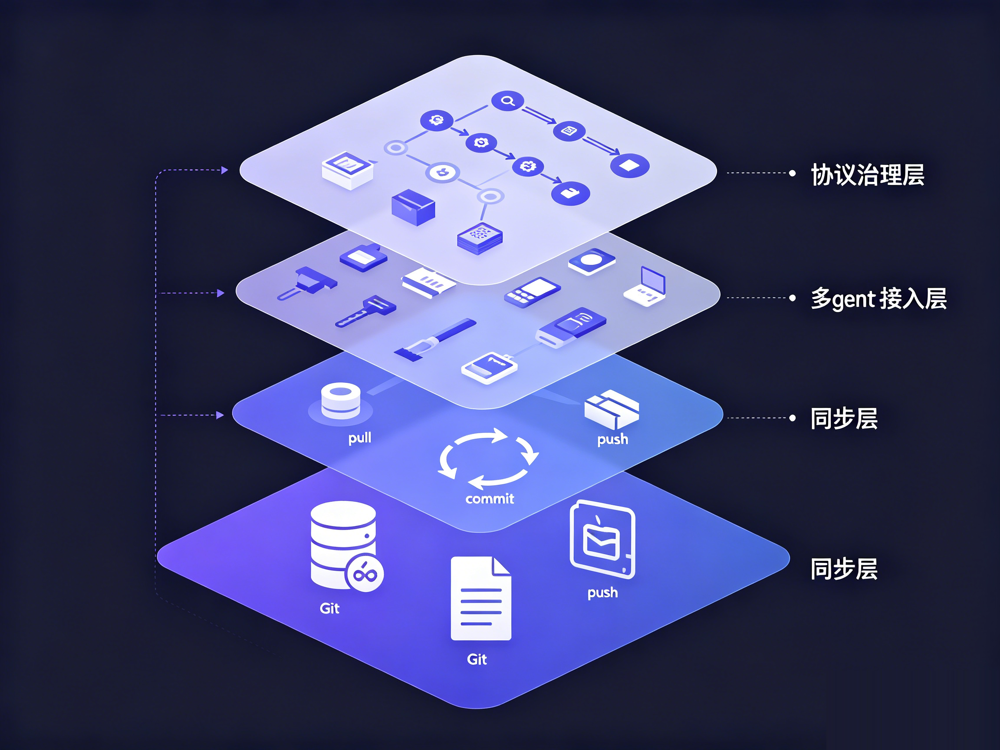

# nestwork: one shared brain for all your AI agents, across machines and vendors

> Current behavior, aligned with protocol 3.1: at startup an agent reads only the small resident tier; strategy, history, projects and the inbox are fetched on demand. A memory scope can also opt into topic memory, where `memory.md` becomes a generated index over topic files. See [Loading and migration](../context-loading.md) and [AGENTS.md](../../AGENTS.md) §6.


You have probably lived through this. You brief Claude Code on a project on your laptop, then you move to your desktop, open Codex, and it knows nothing. So you explain the conventions, the background and the traps you already fell into, all over again.

And that is before the tools themselves start changing. Almost every month there is a new "best model yet". You went from Cursor to Claude Code, then tried Codex, then Gemini. Sometimes the switch is not even your call: policy, region, account, pricing, and one day the tool you depend on simply stops working for you. Every switch sends your agent back to "nice to meet you."

nestwork exists for exactly this. In one sentence: it turns the memory of all your agents into plain text in a git repo you own, so they share one brain across machines, tools and vendors.

It is not a tool, not a hosted service, and it needs no server. It is a protocol. Here is everything it does, in one pass.



## 1. Memory is just markdown in git

The foundation is almost counterintuitively simple: all memory is plain markdown in a git repo, and that repo is the single source of truth. An agent pulls before it works, then commits and pushes when it is done. No database, no backend, no account to sign up for.

Because memory is plain text, you can open it, edit it or roll it back at any time with any editor or git tool. Humans can read it, and so can agents. How a piece of memory came to be, and when it changed, is right there in the git log.

## 2. One shared memory, across machines and vendors

Sync rides on a git remote, so the agents on your laptop, your desktop, a few Linux boxes, even an Android phone, all share the same brain as long as they can push. They do not need to sit on the same machine, and nobody has to open a port for anyone.

It works with a whole class of agents: Claude Code, Codex CLI, Gemini CLI, Hermes, OpenClaw and other markdown-configured tools. Whoever shows up reads the same memory.

This is what takes the sting out of the ever-changing tool landscape. Tying your memory to one tool is a bet that the tool never gets retired and never becomes unavailable to you. Plain text in git does not care which tool reads it: the day you move wholesale from an overseas tool to a domestic model, your context stays put, and the only thing you swap is the agent reading it.

## 3. Inherit it in one click, and the memory lives in your own repo

Onboarding is pure git. Click Use this template on GitHub and you inherit the whole protocol skeleton; clone it and you are connected.

There is an underrated point here: what you inherit is a private repo of your own. From day one the memory lives in your hands, not parked in some vendor's backend. With a hosted memory service, you hand your context over and it sits in someone else's store; with nestwork, ownership of the data never leaves you.

Inheriting instead of forking has another upside. When upstream updates the protocol, the update script only touches the protocol layer and cannot touch your private memory. The strategy you built up over months, and every agent's memory, will not get wiped out by one upstream sync.

## 4. Private, and encryptable, so you dare to write the real stuff

Keeping memory in a private repo is only the first layer. For genuine secrets, you can add git-crypt on top and encrypt before anything enters the repo. Even if the repo is hosted on GitHub, what lands there is ciphertext. The data is yours, and so is the key.

For anyone who wants to feed an agent project internals, internal war stories or business judgment, this is not a nice-to-have. It is the precondition for using it at all.

## 5. The hard part is keeping a crowd of agents from fighting

If this were only "store markdown in git," it would be a clever little trick. What nestwork actually thinks through is the dirty work of many agents on many machines working at the same time.

Write isolation. Every machine and every agent owns, and only writes, its own directory, with a path like `agents/<host>/<agent-id>/`. Nobody writes to the same file as anyone else, so conflicts have nowhere to start. And if a collision does happen, the resolution rules are fixed: take local for your own directory, take remote for someone else's directory, take remote for the upstream-managed shared layers. Whoever owns it decides.

Atomic sync. On tools with per-write hooks (currently Claude Code and Kimi Code), every write to the agent's own directory is preceded by `pull --rebase` and followed by a commit and push, with automatic retry. That squeezes the race window down to the moment of a single write, instead of leaving the whole session exposed. Tools without those hooks, such as Codex and Gemini, get the protocol written into their startup file and commit and push their own directory at the end of the session.

Layered priority and resolution. Memory is ranked: behavior rules > strategy > shared memory > each agent's private memory > projects > methodology. When two instructions conflict, the higher-priority one wins, and you never blend the two. This chain is what keeps a dozen-plus agents behaving consistently: they all read the same "constitution."

Distillation. How do the scattered private observations of each agent settle into facts the whole fleet shares? Through a distillation pass: a sub-agent first reviews for sensitive data, factual errors, contradictions and stale entries, a human confirms, and only then is the result merged into shared memory. Shared memory is a union, not an intersection: duplicates are folded together, but an observation only one agent made is kept, and every agent's private memory is left untouched. `scripts/maintenance/distill.py` prints a ready-to-use prompt for this, or runs the pass through Claude Code or Codex.

Agents can leave each other notes. There is a built-in, git-native mailbox. An agent on machine A finishes a stretch and leaves a line for the agent on machine B: "I'm done with this part, you take it from here." B reads its unread notes on demand, when it is coordinating the relevant task. No message queue, no service: just a file written into the repo and pushed.


## 6. It is a protocol, so it governs more

Calling it a protocol is not just rhetoric. Beyond storing and syncing, it lays down a full set of rules for how memory is used.

Resident at startup, history on demand. At startup an agent pulls and reads only three small resident files: the core rules, a short shared summary and a short summary for itself (the two summaries are optional). On tools with a session-start hook, the hook pulls and lists those paths for the agent. Strategy, historical memory, projects, methodology and the inbox are searched only when the task needs them, and a missing summary never triggers a fallback to reading all of history. Resident files have byte budgets, checked by `scripts/maintenance/check-resident.py`.

There are explicit rules for where memory goes. Project conventions and lessons go into the project's own docs, cross-project methodology goes into `workflow/`, the current state of a project goes into `projects/`, machine-specific facts go into the agent's own directory, and stable cross-agent facts go into shared memory. Knowledge has a fixed home, so it does not turn into a mess.

Oversized files get split. Every markdown file has a line limit, and before writing to one, an agent checks it; near the hard limit, the file is split by topic into an index plus sub-files, so each file stays focused and retrieval stays sharp. Since protocol 3.1, a memory scope can go further and opt into topic memory: facts live in topic files whose front matter says when to read them, `memory.md` becomes an index generated by `scripts/maintenance/memory-index.py`, and an agent reads the index and opens only the topics it needs.

Version governance. The protocol marks its evolution with MAJOR.MINOR: a MAJOR bump may need action on your side, a MINOR bump is additive. The session-start hook tells you when upstream has a newer version, but applies nothing on its own. A private instance can also override the default line limits with its own `queen/limits.md`. It behaves like a spec that iterates, not a static piece of software.

## 7. And there is more (optional, turn it on when you need it)

- If you use claude-mem with Claude Code, nestwork exports its observations when the session ends and pushes them along with your memory, giving its notes cross-machine reach too.
- High-churn, bulky artifacts like local tool history are stored on a separate orphan branch per agent, so the main branch stays lean. This one is off by default, and currently recommended off: even on its own branch it still grows the repo over time.
- When you pull content from an external working directory into nestwork, a `nestwork.config.json` contract in that directory sets the desensitization rules, and ingestion is always triggered by hand, so secrets do not get hauled in unprotected.

## Getting started

Head to GitHub: songth1ef/nestwork. If you find it useful, give it a star.

```bash
# 1. Click Use this template on GitHub to create your own private repo
# 2. Clone it
# 3. Install for each tool you use
bash scripts/install/claude.sh
bash scripts/install/codex.sh
bash scripts/install/gemini.sh
```

After that, Claude Code syncs every memory write on its own, and Codex and Gemini commit and push their memory at the end of each session, as the installed instructions tell them to. You use your agents as usual, except this time, when you switch machines, tools or models, they still remember.

Try it for a week on two devices and two tools. The day you change machines, or move from one tool to another, open an agent and watch it pick up yesterday's work mid-sentence, you will see why this matters.
