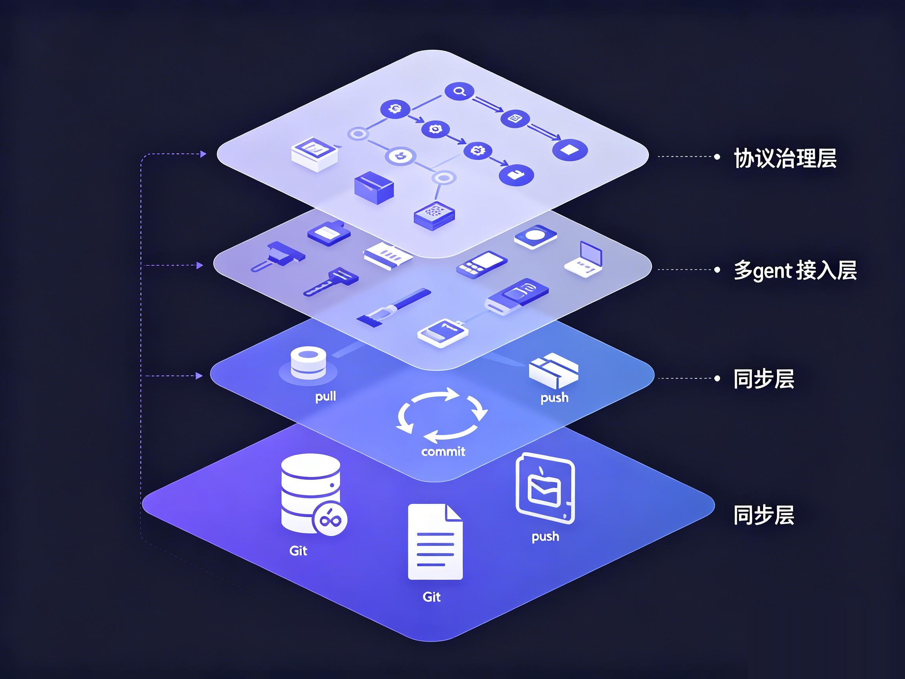
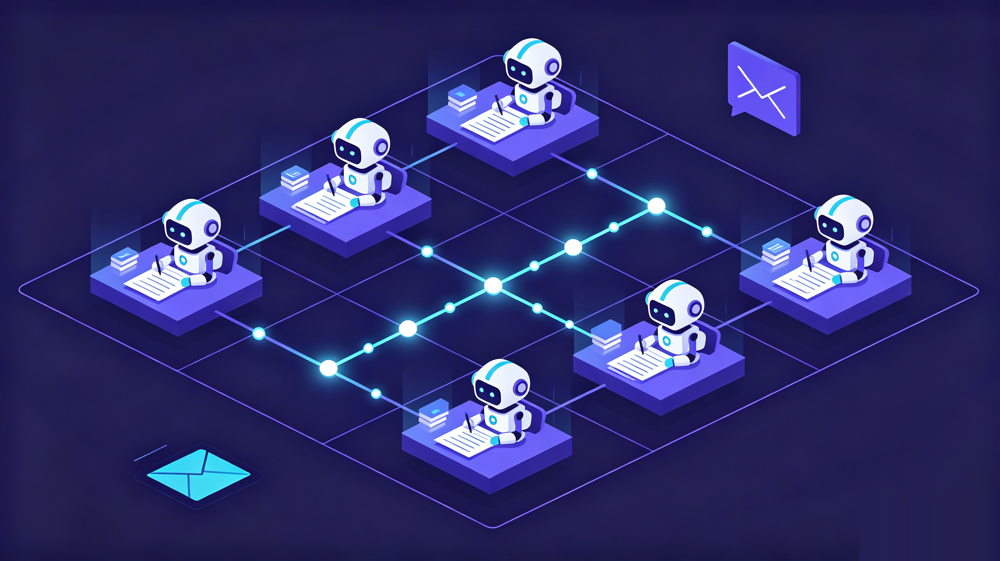

# nestwork:给你所有 AI agent 一个共用的、跨机跨厂商的大脑

> 候选标题:
> - nestwork:给你所有 AI agent 一个共用的大脑
> - 一个 git 仓,管住你所有机器、所有 agent 的记忆
> - 不是又一个记忆数据库,是一套多 agent 协作协议


你大概经历过这个。笔记本上用 Claude Code 把项目交代清楚,换到台式机打开 Codex,它一无所知,你把规范、背景、踩过的坑重讲一遍。

更别说工具一直在换。几乎每个月都有个「当前最强」的模型,你从 Cursor 试到 Claude Code,又试 Codex、Gemini。有时候换不换还轮不到你,政策、地区、账号、价格,哪天你依赖的那个工具就用不了了。每换一次,agent 都停在「初次见面」。

nestwork 是冲这件事来的。一句话:它把你所有 agent 的记忆,变成一个你自己的 git 仓里的纯文本,让它们跨机器、跨工具、跨厂商共用同一个大脑。

它不是一个工具,不是托管服务,不需要服务器。它是一套协议。下面把它能做的事,一次讲清楚。



## 一、记忆就是 git 里的 markdown

nestwork 的底座简单到反直觉:所有记忆是一个 git 仓里的纯 markdown 文件,这个仓就是唯一真相源。agent 干活前 pull,写完 commit、push。没有数据库,没有后端,没有要注册的账号。

记忆是纯文本,意味着你随时能用任何编辑器、任何 git 工具打开看、改、回滚。它给人读,也给 agent 读。一条记忆怎么来的、什么时候改的,git log 里清清楚楚。

## 二、跨机器、跨厂商,共用一份记忆

因为同步走的是 git remote,你的笔记本、台式机、几台 Linux、甚至安卓上的 agent,只要能 push,就在同一个大脑里。不需要它们在同一台机器上,也不需要谁给谁开端口。

兼容的是一整类 agent:Claude Code、Codex CLI、Gemini CLI、Hermes、OpenClaw,以及其它 markdown 配置型的工具。同一份记忆,谁来都能读。

这正好接住了工具一直换的问题。记忆绑在某一个工具上,等于赌它永不被淘汰、永远能用。绑在 git 上的纯文本不挑工具:哪天你要从一个海外工具整体切到国产模型,上下文原样不动,换掉的只是读它的那个 agent。

## 三、一键继承,记忆长在你自己仓里

接入是 git 的母语。在 GitHub 点 Use this template,你就继承了整套协议骨架,clone 下来就接上。

这里有个常被低估的点:你继承来的是一个你自己的 private 仓。记忆从第一天起就长在你手里,不是托管在某个服务商的后台。托管的记忆服务,你把上下文交出去,它就躺在别人的库里;nestwork 里,数据的归属权从头到尾没离开过你。

继承而不是 fork,还有个好处。上游更新协议时,走的是它自己的更新流程,碰的是协议层,碰不到你的私有记忆。你攒了几个月的策略、各 agent 的记忆,不会被一次上游同步冲掉。

## 四、私有,还能加密,敢把真东西写进去

记忆放 private 仓只是第一层。真正的机密,你还能再叠一层 git-crypt,在入库前就加密。就算仓库托管在 GitHub,它存到的也是密文,读不到明文。数据是你的,钥匙也是你的。

对要把项目内幕、内部踩坑、商业判断喂给 agent 的人来说,这不是锦上添花,是敢不敢用的前提。

## 五、真正难的是「一堆 agent 怎么不打架」

如果只是「拿 git 存 markdown」,那是个聪明的小技巧。nestwork 真正想清楚的,是多个 agent、跨多台机器同时干活时的那些脏活。

写隔离。每台机器、每个 agent 都只拥有、也只写自己的目录,路径长这样:agents/<主机名>/<agent-id>/。大家压根不写在同一个文件里,冲突无从谈起。万一真撞上,裁决规则写死:自己目录取本地,别人目录取远端,上游管理的公共层取远端。谁拥有谁说了算。

原子同步。每次写之前 pull --rebase,写之后 commit、push,失败自动重试。这套是装好钩子后自动跑的,竞态窗口被压到一次写入那一瞬,而不是整个会话敞着。

分层与裁决。记忆是分优先级的:行为规则 > 策略 > 共享记忆 > 各 agent 私有 > 项目 > 方法论。两条指令冲突,认高优先级那条,不许把两个揉一起。正是这条链,让十几个 agent 行为一致,读的是同一本「宪法」。

蒸馏。各 agent 私有的零散观察,怎么沉淀成全员共享的事实?走一条蒸馏流程:先派子 agent 审查,查敏感信息、查矛盾、查过时,再交人确认,最后非破坏性地并入共享记忆,只合并、只新增,不删原始记录。

agent 之间能留言。内置一个 git 原生的 mailbox。A 机器上的 agent 干完一段,给 B 机器的 agent 留一句「这块我改完了,你接着往下」,B 启动时自动收未读。没有消息队列、没有服务,就是往仓里写个文件 push 上去。



## 六、它是协议,所以管得更多

把它叫协议不是修辞。除了存和同步,它还规定了一整套「怎么用记忆」的规矩。

启动自动注入。装了钩子的工具,会在每次会话开始自动 pull,并把行为规则、当前策略、共享记忆、这台 agent 的私有记忆、相关方法论一起注入上下文。你不用手动翻一堆文件。

记忆该放哪,有明文规则。项目规范和教训进项目自己的文档,跨项目可复用的方法论进 workflow,当前项目的业务和决策进 projects,跨设备协议进 agent 私有记忆,跨 agent 的稳定事实进共享记忆。知识有固定落点,不会一团乱。

文件太大自动拆。任何 markdown 超过行数上限,就按主题拆成「索引加子文件」,保持每个文件聚焦,agent 检索更准。

版本治理。协议用 MAJOR.MINOR 标记演进,私有实例可以 pin 一个信得过的版本,也能用一个本地文件覆盖默认的行数上限。它像一份会迭代的规范,不是一个静态软件。

## 七、还有这些(可选,用得上再开)

- 在用 claude-mem 的话,nestwork 会在会话结束时把它的观察导出、随记忆一起 push,让它的笔记也获得跨机能力。
- 本地历史这种高频、体积大的产物,走每个 agent 单独的孤儿分支存,主分支保持精简,不会越滚越肥。
- 从一个外部工作目录往 nestwork 吸收内容时,有一套带脱敏规则的契约,机密不会裸奔着被搬进来。

## 上手

去 GitHub:songth1ef/nestwork。觉得有用,先 star 一下。

```bash
# 1. 在 GitHub 点 Use this template,建你自己的私有仓
# 2. clone 下来
# 3. 给每个工具装钩子
bash scripts/install/claude.sh
bash scripts/install/codex.sh
bash scripts/install/gemini.sh
```

装完,pull / commit / push 全自动。你照常用 agent,只不过这次,换台机器、换个工具、换个模型,它都记得住。

先在两台设备、两个工具上试一周。等哪天你换了机器,或者从一个工具切到另一个,打开 agent 发现它张口就接上了昨天的活,你就懂这套东西的价值了。

<!-- nestwork 综合功能版 | humanized | 中文 | 英文版待出 -->
